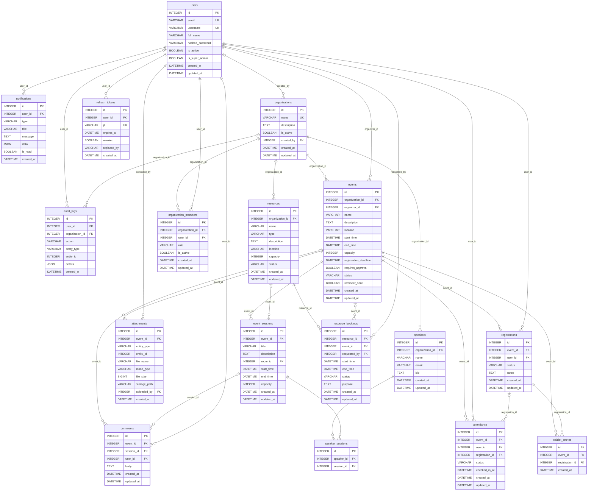

# ER Diagram (auto-generated)

Regenerate with `python scripts/gen_er_diagram.py` from `backend/`.

```mermaid
erDiagram
  users {
    INTEGER id PK
    VARCHAR email UK
    VARCHAR username UK
    VARCHAR full_name
    VARCHAR hashed_password
    BOOLEAN is_active
    BOOLEAN is_super_admin
    DATETIME created_at
    DATETIME updated_at
  }
  notifications {
    INTEGER id PK
    INTEGER user_id FK
    VARCHAR type
    VARCHAR title
    TEXT message
    JSON data
    BOOLEAN is_read
    DATETIME created_at
  }
  organizations {
    INTEGER id PK
    VARCHAR name UK
    TEXT description
    BOOLEAN is_active
    INTEGER created_by FK
    DATETIME created_at
    DATETIME updated_at
  }
  refresh_tokens {
    INTEGER id PK
    INTEGER user_id FK
    VARCHAR jti UK
    DATETIME expires_at
    BOOLEAN revoked
    VARCHAR replaced_by
    DATETIME created_at
  }
  audit_logs {
    INTEGER id PK
    INTEGER user_id FK
    INTEGER organization_id FK
    VARCHAR action
    VARCHAR entity_type
    INTEGER entity_id
    JSON details
    DATETIME created_at
  }
  events {
    INTEGER id PK
    INTEGER organization_id FK
    INTEGER organizer_id FK
    VARCHAR name
    TEXT description
    VARCHAR location
    DATETIME start_time
    DATETIME end_time
    INTEGER capacity
    DATETIME registration_deadline
    BOOLEAN requires_approval
    VARCHAR status
    BOOLEAN reminder_sent
    DATETIME created_at
    DATETIME updated_at
  }
  organization_members {
    INTEGER id PK
    INTEGER organization_id FK
    INTEGER user_id FK
    VARCHAR role
    BOOLEAN is_active
    DATETIME created_at
    DATETIME updated_at
  }
  resources {
    INTEGER id PK
    INTEGER organization_id FK
    VARCHAR name
    VARCHAR type
    TEXT description
    VARCHAR location
    INTEGER capacity
    VARCHAR status
    DATETIME created_at
    DATETIME updated_at
  }
  speakers {
    INTEGER id PK
    INTEGER organization_id FK
    VARCHAR name
    VARCHAR email
    TEXT bio
    DATETIME created_at
    DATETIME updated_at
  }
  attachments {
    INTEGER id PK
    INTEGER event_id FK
    VARCHAR entity_type
    INTEGER entity_id
    VARCHAR file_name
    VARCHAR mime_type
    BIGINT file_size
    VARCHAR storage_path
    INTEGER uploaded_by FK
    DATETIME created_at
  }
  event_sessions {
    INTEGER id PK
    INTEGER event_id FK
    VARCHAR title
    TEXT description
    INTEGER room_id FK
    DATETIME start_time
    DATETIME end_time
    INTEGER capacity
    DATETIME created_at
    DATETIME updated_at
  }
  registrations {
    INTEGER id PK
    INTEGER event_id FK
    INTEGER user_id FK
    VARCHAR status
    TEXT notes
    DATETIME created_at
    DATETIME updated_at
  }
  resource_bookings {
    INTEGER id PK
    INTEGER resource_id FK
    INTEGER event_id FK
    INTEGER requested_by FK
    DATETIME start_time
    DATETIME end_time
    VARCHAR status
    TEXT purpose
    DATETIME created_at
    DATETIME updated_at
  }
  attendance {
    INTEGER id PK
    INTEGER event_id FK
    INTEGER user_id FK
    INTEGER registration_id FK
    VARCHAR status
    DATETIME checked_in_at
    DATETIME created_at
    DATETIME updated_at
  }
  comments {
    INTEGER id PK
    INTEGER event_id FK
    INTEGER session_id FK
    INTEGER user_id FK
    TEXT body
    DATETIME created_at
    DATETIME updated_at
  }
  speaker_sessions {
    INTEGER id PK
    INTEGER speaker_id FK
    INTEGER session_id FK
  }
  waitlist_entries {
    INTEGER id PK
    INTEGER event_id FK
    INTEGER registration_id FK
    DATETIME created_at
  }
  users ||--o{ notifications : "user_id"
  users o|--o{ organizations : "created_by"
  users ||--o{ refresh_tokens : "user_id"
  users o|--o{ audit_logs : "user_id"
  organizations o|--o{ audit_logs : "organization_id"
  organizations ||--o{ events : "organization_id"
  users ||--o{ events : "organizer_id"
  organizations ||--o{ organization_members : "organization_id"
  users ||--o{ organization_members : "user_id"
  organizations ||--o{ resources : "organization_id"
  organizations ||--o{ speakers : "organization_id"
  events ||--o{ attachments : "event_id"
  users ||--o{ attachments : "uploaded_by"
  events ||--o{ event_sessions : "event_id"
  resources o|--o{ event_sessions : "room_id"
  events ||--o{ registrations : "event_id"
  users ||--o{ registrations : "user_id"
  resources ||--o{ resource_bookings : "resource_id"
  events o|--o{ resource_bookings : "event_id"
  users ||--o{ resource_bookings : "requested_by"
  events ||--o{ attendance : "event_id"
  users ||--o{ attendance : "user_id"
  registrations o|--o{ attendance : "registration_id"
  events o|--o{ comments : "event_id"
  event_sessions o|--o{ comments : "session_id"
  users ||--o{ comments : "user_id"
  speakers ||--o{ speaker_sessions : "speaker_id"
  event_sessions ||--o{ speaker_sessions : "session_id"
  events ||--o{ waitlist_entries : "event_id"
  registrations ||--o{ waitlist_entries : "registration_id"
```
